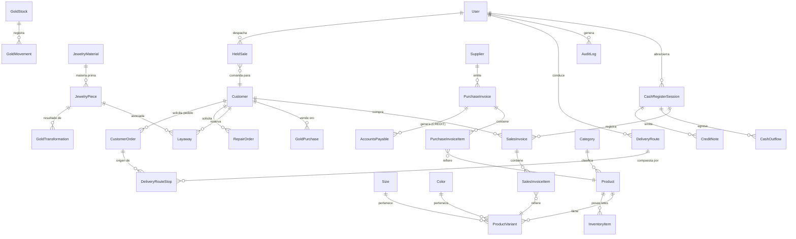

# **Blueprint Técnico y de Producto: JoyeriaPlus**

> **Sistema de Gestión Empresarial (ERP) y Punto de Venta (POS) Especializado en Joyerías y Adaptable Multi-Negocio**

---

## 1. Visión General y Resumen Ejecutivo

**JoyeriaPlus** es una plataforma integral de gestión comercial, punto de venta y control de inventarios desarrollada para operantes de joyería de alta precisión (compra de oro por quilates/gramos, tasa de mercado en tiempo real, fundición, empeños/apartados y taller de reparaciones), manteniendo al mismo tiempo un núcleo flexible **multi-negocio** capaz de operar bajo las modalidades de **Farmacia**, **Boutique** y **Distribuidora**.

### Características Destacadas:
- **Tasación de Oro de Mostrador**: Motor de cálculo en tiempo real basado en la cotización internacional de la Onza Troy en USD, conversión a gramos/quilates, tipo de cambio dinámico y márgenes parametrizables.
- **Ciclo Completo de Joyería**: Compra de pedacería/oro bruto a clientes, fundición/traslado a bóveda virtual, producción de piezas terminadas con mano de obra y gestión de apartados (`Layaway`) / reparaciones (`RepairOrder`).
- **Soporte Multimoneda Nativo**: Transacciones simultáneas en **Córdoba Nicaragüense (C$ NIO)** y **Dólar Estadounidense ($ USD)** con conversión automática y arqueo de caja segregado por moneda.
- **Punto de Venta (POS) & Sesión de Caja**: Control estricto de turnos de cajero con apertura, egresos/retiros de efectivo, notas de crédito, cobros con tarjeta, crédito o abonos, y arqueo ciego final.
- **Matriz de Variaciones (Boutique)**: Gestión de productos por Talla (`Size`) y Color (`Color`) con código de barras y stock independiente por variante.
- **Control de Lotes & Vencimientos (Farmacia)**: Lógica de despacho FEFO (First Expired, First Out) / FIFO.
- **Rutas de Distribución & Ruteros**: Gestión de pedidos de clientes, asignación de rutas de entrega, control de visitas por dirección y cobro en campo.
- **Granos Básicos & Venta Fraccionada**: Ventas por unidad/libra o por empaque (paca/saco/quintal), precios por niveles (Detalle/Mayorista/Paca/Quintal), cantidades decimales y descuento de stock por factores de conversión.
- **Flujo Despachador → Cajero**: Vista mobile-first del despachador para toma de comandas (`HeldSale`) con botón `COBRAR (C$ total)`, cliente opcional (por defecto "CLIENTE GENERAL"), y listado de pendientes en caja con `Comanda #`, despachador, total, hora/fecha y cliente.
- **Seguridad & Auditoría Inmutable**: Control de Acceso Basado en Roles (RBAC) por rutas, hash de contraseñas Bcrypt, tokens JWT y registro de auditoría (`AuditLog`) de acciones sensibles.
- **SPA Ligera + API desacoplada**: Frontend React compilado con Vite y API REST (Hono) reutilizando la lógica de acciones de negocio mediante un dispatcher genérico.

---

## 2. Arquitectura Tecnológica & Stack de Desarrollo

```
 ┌────────────────────────────────────────────────────────────────────────┐
 │                              CLIENT (UI)                               │
 │   React 18 + Vite 7 (SPA) + Tailwind CSS + Radix UI                    │
 │   TanStack Router + TanStack Query + shadcn/ui                         │
 └───────────────────────────────────┬────────────────────────────────────┘
                                     │  HTTP (dev: proxy Vite /api/actions)
                                     ▼
 ┌────────────────────────────────────────────────────────────────────────┐
 │                          API REST (Hono)                               │
 │   Dispatcher genérico: POST /api/actions/:module/:fn                   │
 │   Reutiliza los action modules del dominio vía shims de compatibilidad │
 └───────────────────────────────────┬────────────────────────────────────┘
                                     │
                                     ▼
 ┌────────────────────────────────────────────────────────────────────────┐
 │                         BUSINESS & DOMAIN LOGIC                        │
 │  • GoldPricingEngine  • JewelrySalesService  • JewelryProductionEngine │
 │  • BusinessGuard (contexto multi-negocio)                              │
 └───────────────────────────────────┬────────────────────────────────────┘
                                     │
                                     ▼
 ┌────────────────────────────────────────────────────────────────────────┐
 │                          DATA ACCESS & STORAGE                         │
 │   Prisma ORM 5.22 ──► MySQL (Base de Datos Relacional Central)          │
 └────────────────────────────────────────────────────────────────────────┘
```

| Capa | Tecnología / Herramienta | Descripción / Propósito |
| :--- | :--- | :--- |
| **Framework Frontend** | `React 18.3.1` + `Vite 7.3` | SPA de alta reactividad; Vite se encarga del build, HMR y servidor de desarrollo. |
| **Enrutado (SPA)** | `TanStack Router 1.170` | Router basado en estado; el proyecto usa un *catch-all* + registro de páginas por path (`pages-registry`). |
| **Datos en Cliente** | `TanStack Query 5.102` | Cache, revalidación y estados de carga/error para cada página y query. |
| **Estilos & UI** | `Tailwind CSS 3.4` + `Radix UI` | Sistema de diseño modular (componentes `shadcn/ui`), accesible y responsive con estética oscura/dorada. |
| **Iconografía & Gráficos** | `Lucide React` + `Recharts` | Conjunto de iconos vectoriales modernos y gráficos financieros interactivos. |
| **API Backend** | `Hono 4.13` + `@hono/node-server` | Servidor HTTP en Node; expone un dispatcher genérico de acciones (`/api/actions/:module/:fn`). |
| **Base de Datos** | `MySQL` vía `@prisma/client 5.22` | Motor relacional para almacenamiento persistente con transacciones ACID. |
| **Autenticación & Sesión** | `jose` (JWT) + `bcryptjs` | Tokens JWT sin estado y hash de contraseñas; cookies de sesión con `HttpOnly`. |
| **Validación de Datos** | `Zod 3.24` + `React Hook Form` | Validación estricta de formularios en cliente y servidor. |
| **Pruebas Unitarias** | `Vitest 1.6` + `@testing-library/react` | Suite de pruebas para motores de cálculo y lógica de negocio. |
| **Despliegue Local / Red** | `Node.js` + `PM2` / Scripts `.ps1` / `.bat` | Ejecución resiliente en red local con auto-reanimación de procesos. |

### Modos de Ejecución
| Comando | Descripción |
| :--- | :--- |
| `npm run dev` | Arranca en paralelo la API (Hono, puerto `9003`) y Vite (puerto `5173`) vía `scripts/dev.mjs`. Vite hace proxy de `/api/actions` hacia la API. |
| `npm run build` | `vite build` (estáticos → `dist/`) + `build-server` (API → `dist-server/index.mjs`). |
| `npm start` | Ejecuta la API de producción (`dist-server/index.mjs`), que también sirve los estáticos del frontend en el mismo origen. |
| `npm run generate` | Regenera `action-modules`, `actions-client` y `pages-registry` a partir del código fuente. |

---

## 3. Arquitectura del Frontend SPA (Vite + TanStack)

El proyecto migró de un fullstack Next.js a una **SPA con API desacoplada**. La lógica de dominio (antes Server Actions de Next) se reutiliza tal cual en el servidor mediante shims de compatibilidad.

### 3.1. Registro de Páginas (`pages-registry.tsx`)
- Generado automáticamente por `scripts/generate-pages-registry.mjs` a partir de la estructura `src/app`.
- Cada ruta se envuelve en un *adapter* que carga sus datos iniciales vía `react-query` y `callAction` (transporte HTTP a la API).
- El adaptador desempaqueta el sobre `{ success, data }` de las acciones, muestra un fallback de carga mientras las queries resuelven y expone los parámetros de ruta dinámicos (`[id]`).

### 3.2. Enrutado (`router.tsx` + `src/lib/route-match.ts`)
- TanStack Router se usa con una única ruta *catch-all* (`$`); la página real se resuelve por coincidencia del `pathname`.
- `route-match.ts` implementa el matcheo exacto + dinámico (patrones `[param]` → `/orders/123`) y guarda los parámetros en un store accesible por los adaptadores (`useRouteParams`).
- El `rootRoute` actúa como layout principal con `<Outlet/>` de TanStack Router: los providers globales (Query, Auth, Settings, BusinessMode, CashRegister, PendingSales) permanecen montados y no se desmontan al navegar entre páginas.
- **Control de Acceso por Rutas (RBAC)**: `src/lib/rbac.ts` define `canAccessRoute(role, pathname)`. El `PageRenderer` valida cada ruta y, si el rol no tiene acceso, reorienta al home del rol (`/pos` para despachador, `/dashboard` para el resto) mediante el componente `RedirectTo`.

### 3.3. Transporte de Acciones (`src/lib/actions-client/*` + `src/lib/api-client.ts`)
- `api-client.ts` expone `callAction(module, fn, args)` que hace `POST /api/actions/:module/:fn` con `{ args }`, soportando `FormData` para subidas de archivos y `credentials: 'include'`.
- `src/lib/actions-client/*` son wrappers generados que replican las firmas de los módulos de acción.
- En Vite, los imports `@/lib/actions/*` en código de cliente se redirigen a `@/lib/actions-client/*` (alias en `vite.config.ts`).

### 3.4. Servidor API (`server/`)
- `server/index.ts`: crea la app Hono, configura CORS, aplica el dispatcher y (en producción) sirve `dist/` con fallback SPA.
- `server/dispatcher.ts`: punto único de ejecución — `POST /api/actions/:module/:fn` lee `{ args }`, resuelve el módulo y la función desde `server/action-modules.ts` (generado) y ejecuta dentro de un contexto de request.
- `server/lib/request-context.ts`: contexto por petición vía `AsyncLocalStorage` (cookies de sesión y caché), replicando `next/headers`.
- `server/shims/*`: compatibilidad de `next/headers`, `next/cache`, `server-only` y `react` cache para que los action modules originales corran sin cambios.
  - ⚠️ El shim `cache` de `react` es **por-request** (usa el `cacheStore` del `RequestContext`), garantizando que `verifySession()` decodifique el JWT de la cookie real de cada petición y no uno cacheado globalmente.

### 3.5. Compatibilidad de Navegación en Cliente (`src/lib/router-nav.tsx`)
- Los imports heredados de `next/navigation` y `next/link` se resolvieron en módulos respaldados por TanStack Router:
  - `useRouter`, `usePathname`, `useSearchParams`, `useParams`, `redirect`, `notFound` y el componente `Link` (acepta `to` u `href`).
  - Los shims de `next/*` fueron eliminados; la navegación es 100% SPA (sin recargas completas).

---

## 4. Arquitectura Multi-Negocio (`businessMode` + `BusinessGuard`)

El sistema cuenta con un motor contextual alimentado por el campo `businessMode` de `SystemSettings`, regulado por la clase guardiana `BusinessGuard` (`src/lib/business-guard.ts`).

```typescript
type BusinessMode =
  | 'JEWELRY'       // Módulos completos de tasación de oro, producción, empeños y reparaciones
  | 'PHARMACY'      // Control de lotes, fechas de caducidad (FEFO) y catálogo médico
  | 'BOUTIQUE'      // Variaciones de Talla/Color, matriz de productos y ropa
  | 'DISTRIBUIDORA' // Rutas de entrega, pedidos de clientes y cobros en campo
```

### Comportamiento del `BusinessGuard`:
- **Modo Joyería (`JEWELRY`)**: Habilita en la barra lateral e interfaces los accesos a `Compra de Oro`, `Producción`, `Inventario de Oro`, `Ventas Joyería`, `Cierre Diario` y `Sincronización CSV`.
- **Modo Farmacia (`PHARMACY`)**: Activa en el formulario de productos los campos de Lote, Registro Sanitario y Caducidad, ajustando el desfalco de inventario según vencimiento más cercano.
- **Modo Boutique (`BOUTIQUE`)**: Despliega la matriz de variaciones por talla y color en la creación de productos y en la terminal POS.
- **Modo Distribuidora (`DISTRIBUIDORA`)**: Desbloquea la gestión de Pedidos, Rutas de Entrega, asignación a Ruteros y Cobranza en campo. Soporta **granos básicos y productos fraccionables** con venta por unidad/libra o empaque (paca/saco/quintal) y precios por niveles (Detalle/Mayorista/Paca/Quintal).

---

## 5. Desglose Detallado de Módulos del Sistema

### 5.1. Módulo Especializado de Joyería (`src/lib/services/`)

#### A. Motor de Precios de Oro de Mostrador (`GoldPricingEngine`)
Implementa la **fórmula exacta de mostrador** para la compra y valoración de oro:

$$ \text{Precio Puro USD} = \frac{\text{MarketPricePerOunce}}{31.10} $$

$$ \text{Precio Puro C\$} = \text{Round}\left(\text{Precio Puro USD} \times \text{ExchangeRate}, 2\right) $$

$$ \text{Fine Gold Grams} = \text{GrossWeightGrams} \times \left(\frac{\text{PurityPercent}}{100}\right) $$

$$ \text{Valor Mercado Pieza} = \text{Fine Gold Grams} \times \text{Precio Puro C\$} $$

$$ \text{Total a Pagar (C\$)} = \text{Round}\left(\text{Valor Mercado Pieza} \times \left(\frac{\text{MarginPercent}}{100}\right), 2\right) $$

$$ \text{Total USD} = \text{Round}\left(\frac{\text{Total a Pagar (C\$)}}{\text{ExchangeRate}}, 2\right) $$

*Nota: La constante de la Onza Troy se mantiene fija en 31.10 gramos.*

#### B. Compra de Oro a Clientes (`GoldPurchase`)
- Registro de transacciones de compra de oro bruto o joyas usadas a clientes.
- Cálculo automático de gramos de oro puro, equivalencia en quilates y precio a pagar.
- Emisión de comprobantes de compra con número de compra autoincrementable.

#### C. Bóveda Virtual & Movimientos de Oro (`GoldStock`, `GoldMovement`)
- Control de inventario de oro acumulado clasificado por quilataje ($10K, 14K, 18K, 24K$).
- Historial de movimientos (`PURCHASE`, `MELT`, `TRANSFORMATION`, `SALE`, `ADJUSTMENT`).
- Registro de procesos de **Fundición (Melt)** para transformar pedacería en materia prima para taller.

#### D. Catálogo de Piezas & Producción (`JewelryPiece`, `GoldTransformation`)
- Fabricación de joyas terminadas utilizando oro de la bóveda.
- Incorporación de costos de mano de obra (`laborCost`), margen de ganancia pretendido e identificación de ubicación física en exhibición (`location`).
- Generación de código único/SKU por pieza.

#### E. Sistema de Apartados / Empeños (`Layaway`)
- Reserva de piezas de joyería con pago de prima inicial (`downPayment`).
- Cálculo automático del saldo pendiente (`remainingAmount`) y fecha de vencimiento (`dueDate`).
- Transición de estados: `ACTIVE` $\rightarrow$ `COMPLETED` (entrega de la pieza) o `EXPIRED` / `CANCELED` (reingreso al inventario).

#### F. Taller de Reparaciones (`RepairOrder`)
- Recepción de piezas de clientes para mantenimiento o reparación.
- Registro de peso recibido (`receivedWeight`), abono inicial (`advancePayment`), fecha estimada de entrega y precio final.
- Trazabilidad de estados: `RECEIVED` $\rightarrow$ `IN_PROGRESS` $\rightarrow$ `COMPLETED` $\rightarrow$ `DELIVERED`.

#### G. Cierre Diario de Joyería (`daily-closing`)
- Módulo de auditoría al final de la jornada para cuadrar los gramos de oro físico en bóveda, ventas de piezas, compras de oro y efectivo en caja.

---

### 5.2. Punto de Venta (POS) & Control de Caja (`src/app/(app)/pos`)

#### A. Sesión de Caja (`CashRegisterSession`)
- **Apertura de Caja**: Registro de monto inicial en C\$ y USD por cajero.
- **Control Operativo**: Registro automático de ventas clasificadas por método de pago (Efectivo NIO, Efectivo USD, Tarjeta, Crédito, Abonos, Servicios).
- **Egresos/Retiros (`CashOutflow`)**: Salidas de dinero justificadas asociadas a la sesión activa.
- **Devoluciones & Notas de Crédito (`CreditNote`)**: Cancelación parcial o total de facturas con generación de nota de crédito.
- **Arqueo Ciego & Cierre**: El cajero ingresa el conteo de dinero físico (`actualCash`, `actualUSD`), el sistema calcula la diferencia y genera el reporte consolidado.

#### B. Terminal POS Interactivo
- Búsqueda en tiempo real por escáner de código de barras o teclado.
- Selección de variaciones (talla/color) o especificación de precio manual en servicios.
- Cobro multimoneda instantáneo con cálculo dinámico de cambio en C\$ o USD.
- **Cantidades decimales**: para productos fraccionables (granos básicos) el carrito acepta 0.5 / 1.5 / 2.5 unidades.
- **Presentación de venta**: los ítems con `hasBoxOption`/`isFractional` ofrecen elegir **Unidad/Libra** vs **Empaque (Caja/Paca/Quintal)**; el subtotal de línea usa el precio del nivel o `boxPrice`, y el stock se descuenta por la conversión (1 paca × 25 = 25 unidades base).

#### C. Flujo Despachador → Cajero (`DispatcherPOS` + `CashierPOS`)
- Cuando `workflow === 'dispatcher-cashier'`, el rol **DISPATCHER** ve de forma exclusiva la vista mobile-first `DispatcherPOS` (`src/components/pos/dispatcher-pos.tsx`):
  - **3 bloques**: selector de cliente, catálogo/escáner de productos y carrito táctil (bottom sheet con +/−/eliminar).
  - **Barra inferior fija**: total de ítems y botón principal de **COBRAR**:
    - Carrito vacío → **"SELECCIONAR PRODUCTOS"** (deshabilitado, `opacity-50 cursor-not-allowed`).
    - Con productos → **"COBRAR ( C\$ total )"** en blanco/grueso; abre el `PaymentSummaryDialog` (Total, Pagado, Cambio) y al confirmar **CONTINUAR** persiste la comanda.
  - **Cliente opcional**: si no se selecciona cliente, se asigna automáticamente **"CLIENTE GENERAL"**.
  - Al confirmar, persiste una **comanda** en `HeldSale` (vía `createHeldSale`) con metadatos: nombre del cliente (o CLIENTE GENERAL), `dispatcherName` (vendedor), `total` y `createdAt` (hora/fecha); muestra toast de éxito y limpia el carrito.
  - Sin elementos de cobro/arqueo directo: el despachador solo toma la comanda.
- El rol **CASHIER** recibe esas comandas desde `CashierPOS`, que presenta la lista de pendientes como tarjetas identificables al instante:
  - `[Comanda #NNN | Despachador: Juan | C$ 109.25 | 03:29 PM - 23/08/2026] - Cliente: General / Maria Lopez`.
  - Al seleccionar, carga los ítems, cobra y descuenta inventario/Kardex con la conversión de empaques correspondiente.
- **Robustez del POS**: los errores de comunicación de extensiones del navegador (`Unchecked runtime.lastError: Could not establish connection`) se silencian globalmente en `main.tsx` sin afectar errores reales; el modal de cliente usa `max-h-[85vh]` con scroll y footer visible.

---

### 5.3. Inventario General & Variaciones (`src/app/(app)/inventory`)

- **Productos & Categorías**: Árbol jerárquico de categorías, gestión de marcas, género, unidades de medida y stock mínimo de alerta.
- **Selector de categorías buscable**: el modal "Añadir Nuevo Artículo" usa un `CategoryCombobox` (Popover + input con filtro en tiempo real) que deduplica las categorías por nombre.
- **Precios por Niveles (Escalas)**: cada producto soporta hasta 4 niveles de precio: `Precio Detalle` (`priceNIO`), `Precio Por Mayor / Media Paca` (`price2`), `Precio Paca / Bulto` (`price3`) y `Precio Quintal / Volumen Especial` (`price4`).
- **Venta Multi-Empaque & Fraccionada**: campos `hasBoxOption`, `unitsPerBox`, `boxPrice`, `isFractional`, `bulkUnit` (paca/saco/quintal) y `baseUnit` (libra/unidad). El inventario se registra y descuenta siempre en la **unidad mínima base**.
- **Matriz de Variantes (`ProductVariant`)**: Combinaciones únicas de Talla (`Size`) y Color (`Color`) con precio, costo y código de barras propio.
- **Lotes & Vencimientos (`InventoryItem`)**: Trazabilidad de fechas de vencimiento y lotes de proveedores.
- **Kardex de Inventario (`InventoryMovement`)**: Auditoría inmutable de todas las entradas, salidas, ajustes de inventario y ventas con marca de agua de usuario.
- **Historial de Importaciones (`ImportHistory`)**: Registro de sincronizaciones CSV/Excel con detalle de filas exitosas/fallidas.

#### Importación Excel (plantilla y parser)
- La plantilla `plantilla_inventario.xlsx` (Modo Distribuidora/General) usa este orden de columnas:
  `Nombre del Producto | Código de Barras | Categoría | Precio_Nivel_1 | Precio_Nivel_2 | Precio_Nivel_3 | Precio_Nivel_4 | Unidad_Base | Presentacion_Empaque | Cantidad_Por_Empaque | Es_Fraccionable | Precio de Costo | Stock Mínimo | Unidad de Medida | Tipo de Inventario | Lote | Cantidad | Fecha de Vencimiento`
- **Niveles de precio**: `Precio_Nivel_1` (Base/Detalle → `priceNIO`), `Precio_Nivel_2` (Bulto/Paca/Intermedio → `price2`), `Precio_Nivel_3` (Mayorista/Volumen → `price3`), `Precio_Nivel_4` (Especial/Distribución → `price4`). Se gestionan exclusivamente con el esquema de Niveles de Precio; no hay columnas de precio por empaque.
- **Unidades/conversión**: `Unidad_Base` (libra/litro/unidad — unidad física del Kardex), `Presentacion_Empaque` (quintal/paca/caja/bidón), `Cantidad_Por_Empaque` (factor multiplicador, ej. Quintal=100, Paca=25, Bidón=20, Caja=12), `Es_Fraccionable` (TRUE/FALSE).
- Columnas clásicas: Lote, Cantidad, Fecha de Vencimiento, etc.
- Filas de ejemplo incluyen granos básicos (Arroz Paca 25lbs, Frijol Quintal 100lbs), líquidos (Aceite Bidón 20L) y artículos sin empaque (Anillos/Aretes).
- El parser (`validateRow` en `import-inventory-dialog.tsx`) acepta las columnas nuevas (con compatibilidad hacia atrás), y `bulkImportInventory` persiste los niveles de precio y los campos de empaque/conversión en `Product`.
- **Venta fraccionada**: si `Es_Fraccionable` es TRUE, el POS permite cantidades decimales (0.5 quintal, 0.5 bidón, 2.5 lb); el stock maestro siempre se descuenta en `Unidad_Base` (`cantidad × Cantidad_Por_Empaque`, ej. 0.5 bidón × 20 = 10 litros) y el precio se calcula con el Nivel de Precio seleccionado × cantidad (o fracción × factor de empaque).

---

### 5.4. Compras a Proveedores (Encabezado + Detalle) (`src/app/(app)/purchases`)

- **Encabezado (`PurchaseInvoice`)**: `supplierId`, `invoiceNumber`, `paymentType` (`CASH`/`CREDIT`), `issueDate`, `dueDate`, `subtotal`, `tax`, `discount`, `totalAmount`, `paidAmount`, `status` y `details`.
- **Detalle (`PurchaseInvoiceItem`)**: por línea, `purchaseInvoiceId`, `productId`, `presentation` (`UNIT`/`BOX`/`QUINTAL`), `quantity`, `unitCost`, `subtotal` y `unitsConverted` (las unidades físicas base ya convertidas, p. ej. 20 quintales × 100 = 2000 libras).
- **Transacción atómica** (`createPurchaseInvoiceWithItems` dentro de `db.$transaction`):
  1. Crea el maestro `PurchaseInvoice`.
  2. Inserta los ítems en `PurchaseInvoiceItem`.
  3. Incrementa el stock real (`InventoryItem` / `ProductVariant.stock`) aplicando la conversión Caja/Quintal → Libras/Unidades.
  4. Genera el movimiento de entrada en el Kardex (`InventoryMovement`).
  5. Si `paymentType === 'CREDIT'`, registra la cuenta por pagar al proveedor en `AccountsPayable` (`amount`, `paidAmount`, `status`, `dueDate`).
- El costo unitario de la presentación mayor se divide (`cost / unitsPerBox`) para reflejar el costo por unidad base en el Kardex.

---

### 5.5. Clientes, Crédito & Logística de Rutas (`src/app/(app)/delivery-routes`)

- **Gestión de Clientes (`Customer`)**: Registro de datos de contacto, documento de identidad, asignación de crédito habilitado (`hasCredit`), límite de crédito y saldo pendiente.
- **Abonos a Crédito (`CreditPayment`)**: Registro de pagos a cuentas por cobrar con comprobante de recibo impreso.
- **Logística de Rutas de Entrega (`DeliveryRoute`, `DeliveryRouteStop`)**:
  - Creación de rutas de distribución asignadas a un rutero/cobrador (`User`).
  - Generación de paradas por pedido de cliente (`CustomerOrder`).
  - Control de entregas y cobranza en campo (`CollectionPayment`).

---

### 5.6. Seguridad, Licenciamiento & Auditoría (`src/app/(app)/users`, `src/actions/activation.ts`)

- **Control de Acceso por Roles (RBAC)**:
  - `ADMIN`: Acceso total a configuraciones, reportes, usuarios y ajustes.
  - `CASHIER` (Cajero): Acceso a POS, apertura/cierre de caja y clientes.
  - `DISPATCHER` (Despachador): Acceso exclusivo a su vista de toma de pedidos `/pos` (mobile-first). Al iniciar sesión se le redirige a `/pos`; si intenta navegar a `/users`, `/settings`, `/reports`, `/kardex`, `/cash-count`, `/customers/credit`, etc., el router lo reorienta a `/pos` (`canAccessRoute`). En el menú lateral solo ve los ítems permitidos.
  - `RUTERO`: Acceso a rutas de entrega y cobro en campo.
- **Sesiones aisladas**: `verifySession()` decodifica el JWT de la cookie real de cada petición (caché por-request vía AsyncLocalStorage), y la cookie `session` se emite `HttpOnly` (Secure solo en producción), se sobrescribe en login y se limpia en logout.
- **Registro de Auditoría (`AuditLog`)**: Captura inmutable de acciones críticas (IP, usuario, tipo de entidad, ID, descripción y metadatos JSON).
- **Sistema de Licenciamiento (`SystemSettings`)**: Validación de activación mediante claves, control de fecha de vencimiento de licencia y estado de activación del sistema (`isActivated`, `isPremium`).
- **Activación automática**: si se detectan datos previos (usuarios, piezas o productos) sin `SystemSettings` activado, el sistema se auto-activa para evitar bloqueos.

---

## 6. Modelo de Datos (Diagrama ER Principal)



---

## 7. Guía de Estilos & Principios de UX/UI

### Paleta de Colores Corporativa
- **Color Primario (Joyería Gold)**: `#D4AF37` / `#B8860B` (Acentos dorados elegantes para estados de valor y botones de acción principal).
- **Fondo / Tema Oscuro (Dark Slate)**: `#0F172A` / `#1E293B` (Diseño limpio, profesional y de baja fatiga visual).
- **Acento Verde Éxito**: `#10B981` (Ventas completadas, caja cuadrada, saldo a favor).
- **Acento Rojo Alerta**: `#EF4444` (Egresos, diferencias en arqueo, piezas vencidas).

### Principios de Interfaz:
1. **Glassmorphism & Bordes Sutiles**: Uso de contenedores semitransparentes con desfoque de fondo (`backdrop-blur-md`) y bordes suaves (`border-white/10`).
2. **Diseño Adaptativo Táctil**: Botones con área táctil optimizada para monitores de punto de venta (pantallas táctiles) y tabletas.
3. **Indicadores de Carga & Skeletons**: Interfaz fluida que presenta marcadores de posición (`Skeletons`) o spinners en lugar de pantallas en blanco durante la carga de datos.
4. **Respuesta Visual en Tiempo Real**: Animaciones micro en botones, actualización instantánea de totales en el POS y notificaciones toast ante eventos clave.

---

## 8. Roadmap Tecnológico (2026+)

### Q3 2026
- [x] Motor completo de tasación de oro y compras a clientes.
- [x] Control de apartados, empeños y reparaciones de joyería.
- [x] Matriz de variaciones por Talla y Color (Boutique).
- [x] Módulo de rutas de entrega y cobranza en campo.
- [x] **Migración a SPA (Vite) + API desacoplada (Hono)**: los módulos de dominio de Next Server Actions se reutilizan vía dispatcher y shims; frontend con TanStack Router/Query.
- [x] **Registro de páginas y enrutado SPA**: generador de `pages-registry`, adaptadores con carga de datos, matcheo de rutas dinámicas (`[id]`) y páginas de joyería adaptadas al cliente.
- [x] **Vista mobile-first del Despachador**: flujo `dispatcher-cashier` con `DispatcherPOS` (toma de comandas) + `CashierPOS` (cobro), persistencia en `HeldSale`.
- [x] **Botón COBRAR con resumen de pago**: estado vacío ("SELECCIONAR PRODUCTOS", deshabilitado) vs activo ("COBRAR (C\$ total)") que abre `PaymentSummaryDialog`; cliente opcional con "CLIENTE GENERAL" por defecto; lista de pendientes en caja con `Comanda # / Despachador / Total / Hora / Cliente`.
- [x] **Robustez UI del POS**: silenciado global de errores de extensión del navegador (`runtime.lastError`), y modal de cliente con `max-h-[85vh]` + scroll + footer visible.
- [x] **RBAC por rutas**: `canAccessRoute` reorienta al home del rol; dispatcher restringido a `/pos`.
- [x] **Venta Multi-Empaque y Fraccionada**: niveles de precio (Detalle/Mayorista/Paca/Quintal), unidades/conversión (`unitsPerBox`, `baseUnit`, `bulkUnit`, `isFractional`), cantidades decimales en POS y descuento de stock por conversión.
- [x] **Compras Encabezado + Detalle**: `PurchaseInvoice` + `PurchaseInvoiceItem` + `AccountsPayable` en transacción atómica con conversión de empaques y Kardex.
- [x] **Importación Excel avanzada**: plantilla con `Precio_Nivel_1..4`, `Unidad_Base/Presentacion_Empaque/Cantidad_Por_Empaque` y `Es_Fraccionable`; parser con validación, deduplicación de categorías y venta fraccionada (medios quintales/bidones).

### Q4 2026
- [ ] ⚖️ **Integración Hardware**: Lectura directa de balanzas digitales de precisión vía puerto Serial/USB para captura de peso en tiempo real.
- [ ] 🖨️ **Impresión Térmica Nativa**: Driver ESC/POS para impresión directa en comanderas de 80mm y 58mm sin cuadro de diálogo del navegador.
- [ ] 📱 **App Móvil de Ruteros**: Aplicación PWA/React Native offline para cobradores y repartidores.
- [ ] 📊 **Business Intelligence (BI)**: Tableros de predicción de demanda de oro y productos con exportación avanzada a Excel/PDF.